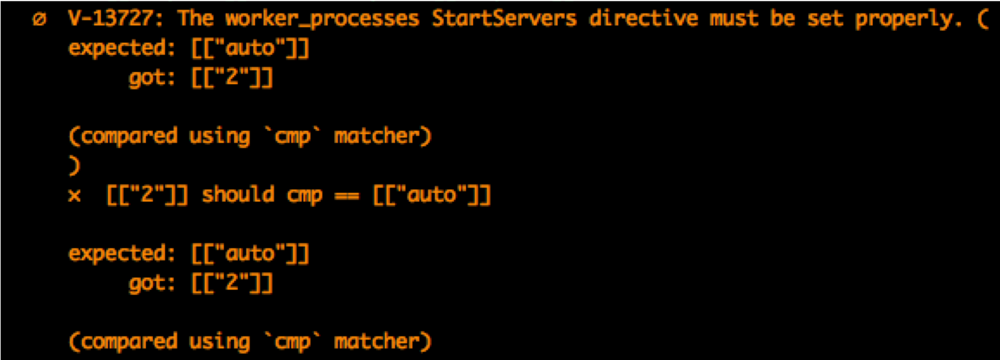

### Check-In
::: details  Have you used InSpec before?
There is no right or wrong answer. If this is your first time using InSpec, welcome! If you have used it before, welcome back. If you want more information on the basics of Ruby (InSpec is built on Ruby), take a look at the Ruby materials linked on the [home page](../../).
:::

::: details Which goal of the MITRE Security Automation Framework (SAF) is supported by InSpec?
InSpec is used in the [Validate pillar](https://saf.mitre.org/#/validate). InSpec is used to do security validation.

_Note that InSpec is not the only validation solution, but the one preferred at the SAF. You are not required to use InSpec to use the rest of the SAF nor are you required to use the rest of the SAF to use InSpec._
:::

::: details Is your Codespace environment set up successfully?
To check, run `./verify-lab.sh`.
This class will have hands-on activities. We recommend that you use the provided class [development lab environment](https://github.com/mitre/saf-training-lab-environment) to participate in the hands-on activities. 
:::

## What is an InSpec Profile?

### InSpec Profiles  

InSpec organizes its code into `profiles`. A `profile` is a set of automated tests that usually relates directly back to a Security Requirements Benchmark -- such as a CIS Benchmark or a Defense Information Security Agency (DISA) Security Technical Implementation Guide (STIGs) - and provides an organized structure to articulate that set of requirements using tests in code.

**Profiles have two (2) required elements:**
- An `inspec.yml` file 
- A `controls` directory

**and four (4) optional elements:**
- A `libraries` directory 
- A `files` directory
- An `inputs.yml` file 
- A `README.md` file

You can learn all the details here: <https://docs.chef.io/inspec/profiles/>

We will be going over each of these during our class.
### InSpec Profile Structure  

```sh
$ tree nginx
      nginx
      └── profile
          ├── README.md
          ├── inputs.yml
          ├── controls
          │   ├── V-2230.rb
          │   └── V-2232.rb
          ├── files
          │   └── services-and-ports.yml
          ├── inspec.yml
          └── libraries
              └── nginx_helper.rb
```

---

### InSpec Controls Structure

```ruby
control "V-13727" do
  title "The worker_processes StartServers directive must be set properly."

  desc "These requirements are set to mitigate the effects of several types of
  denial of service attacks. Although there is some latitude concerning the
  settings themselves, the requirements attempt to provide reasonable limits
  for the protection of the web server. If necessary, these limits can be
  adjusted to accommodate the operational requirement of a given system."

  impact 0.5
  tag "severity": "medium"
  tag "gtitle": "WA000-WWA026"
  tag "gid": "V-13727"
  tag "rid": "SV-36645r2_rule"
  tag "stig_id": "WA000-WWA026 A22"
  tag "nist": ["CM-6", "Rev_4"]

  tag "check": "To view the worker_processes directive value enter the
  following command:
  grep ""worker_processes"" on the nginx.conf file and any separate included
  configuration files
  If the value of ""worker_processes"" is not set to auto or explicitly set,
  this is a finding:
  worker_processes   auto;
  worker_processes defines the number of worker processes. The optimal value
  depends on many factors including (but not limited to) the number of CPU
  cores, the number of hard disk drives that store data, and load pattern. When
  one is in doubt, setting it to the number of available CPU cores would be a
  good start (the value “auto” will try to autodetect it)."

  tag "fix": "Edit the configuration file and set the value of
  ""worker_processes"" to the value of auto or a value of 1 or higher:
  worker_processes auto;"

  describe nginx_conf(NGINX_CONF_FILE).params['worker_processes'] do
    it { should cmp [['auto']] }
  end
end
```

### InSpec Results

#### Failure



#### Pass


#### Multiple Controls


### Tooling and Reporting


