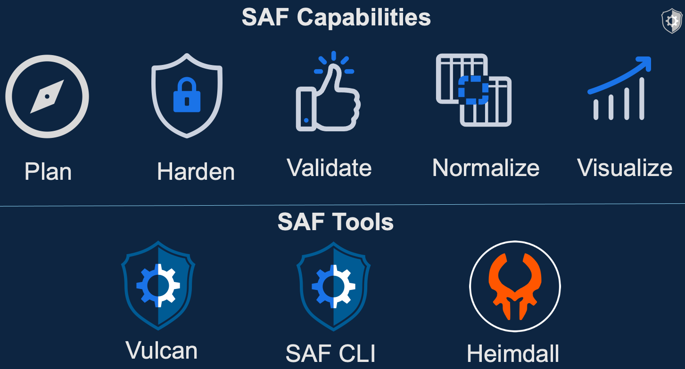
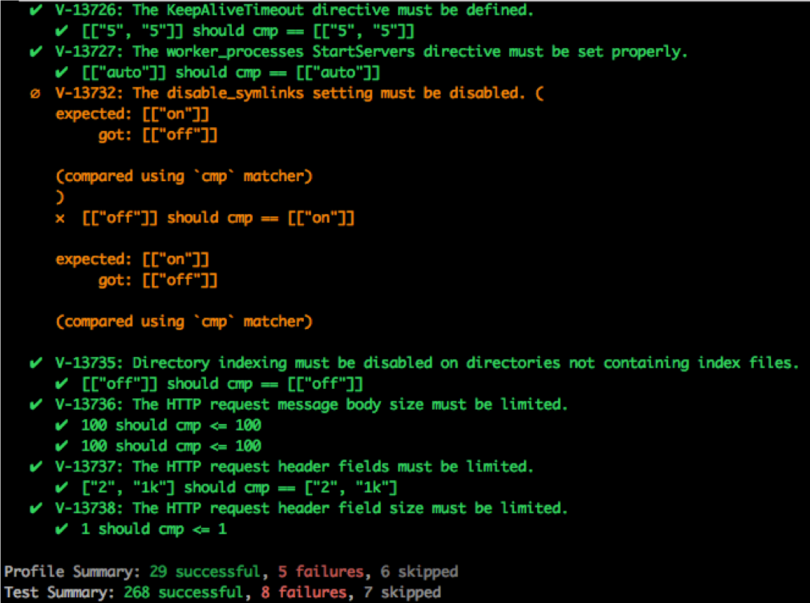

## 3. SAF Scavenger Hunt
Explore the [SAF homepage](https://saf.mitre.org/) to find the answers to this scavenger hunt and familiarize yourself with the topics of this course. When you are done, check your answers!

::: details 1. What are the main pillars of the SAF?
The main pillars are 
- Plan (coming soon to the website)
- Harden
- Validate
- Normailze
- Visualize

We help teams plan what guidance will help them keep their software secure. We also provide libraries and tools for automatically hardening and validating software based on that guidance, normalize other security data, and visualize all the information to properly inform teams of risk and vulnerabilities. 
:::

::: details 2. Is SAF a tool? Why or why not?
Nope! 

SAF, the Security Automation Framework, is a Framework and uses a COLLECTION of tools, techniques, applications, and libraries to streamline security automation. Since teams operate in different environments with different components, not everyone's security journey will look the same.

Among the provided tools, some notable tools within the Security Automation Framework are Vulcan, the SAF CLI, and Heimdall.

:::

::: details 3. What is HDF?
[HDF](https://saf.mitre.org/#/normalize), or Heimdall Data Format, is a common format to represent normalized security data. HDF files record vital security data about a completed validation test, such as the test code, description, attributes, and outcome. This allows for the aggregation and analysis of test results from a wide range of validation tools at once.

HDF data can be easily visualized in [Heimdall](https://heimdall-lite.mitre.org/), the SAF's visualization application.
:::

::: details 4. Which of the following is NOT a tool that SAF provides to help in the security automation process? (eMASS Client, InSpec, SAF CLI, Heimdall, Vulcan)
InSpec is not a tool, rather it is a language developed by Chef that MITRE and other security community members use to write InSpec profiles which are sets of controls for automating security validation. You can view InSpec profiles on the [validation section of the SAF site](https://saf.mitre.org/#/validate). You can see more information on how to run InSpec profiles on the [getting started section](https://saf.mitre.org/#/getstarted). The available tools are found under the "How We Support It" section of the [site](https://saf.mitre.org/).
:::

<!-- ### 2.1. Identifying your stack and checking for a profile using the saf site

### 2.2. Reviewing README for a profile and understanding how to use them

### 2.3. Understand the most appropriate way of running InSpec

### 2.4. Learning how to run InSpec

### 2.5. Tooling and Reporting

 -->
