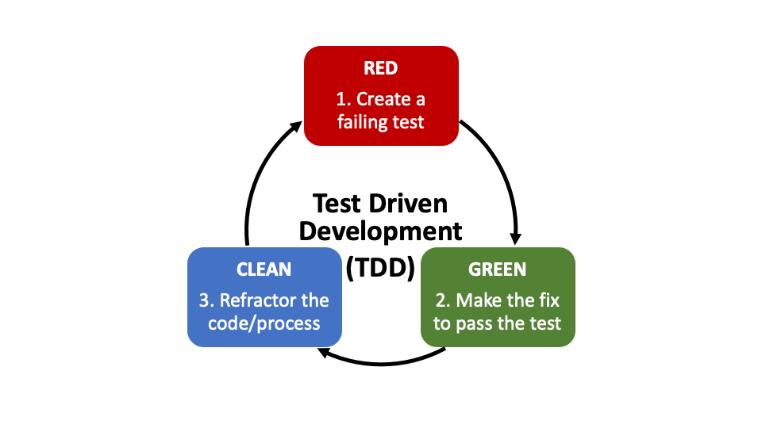
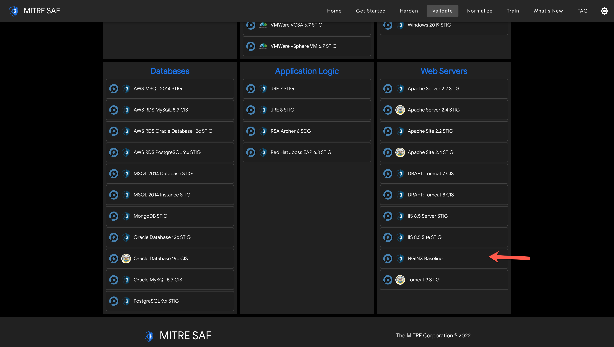

## 5. From "Plan" to "Validate"

After identifying software components for your environment and knowing what security guidance exists for those components, a great next step is validation, or in other words, testing.

::: info WAIT!
But what about the "Harden" pillar? Why would we focus on testing that a software component is secure before we secure it?

Actually, starting with the tests, rather than the changes to be tested, can level-set the expectations and see what the current state of the software is while giving a clear understanding of the goal or measurement of success. 

When using this mindset in software development, this kind of development can be referred to as Test Driven Development.
:::

::: details A note on Test Driven Development (TDD)
The idea of using Test Driven Development (in other words, having the code driven by tests and therefore, the requirements) helps the humans confirm that the software does exactly what it is supposed to do - not more and not less. 

This process starts with a FAILING test. Then, the minimal amount of change required is done to fix the code so that the test passes. Once the test passes, the code can be refactored to be cleaner, more readable, etc. This is a cycle, and returns to the top to create a new failing test. As development continues, all tests should be run to confirm that all tests still pass! These tests can be put in an automated suite to validate the code set whenever there are changes overall.

The SAF team values this methodology and helps teams implement security compliance tests using InSpec so they can understand the state of the system and the goal state of a secured system, using automated tests to get this information easier, quicker, and more often!

:::

## 5.1 What is InSpec?
"Chef [InSpec](https://www.chef.io/downloads/tools/inspec) is an infrastructure security and compliance testing framework with a human- and machine-readable language for comparing actual versus desired system state." 

The SAF uses InSpec profiles to test software components against a security baseline. These automated tests produce data showing what security controls passed or failed, or were skipped or not reviewed and gives the reason and more information to fix it if not passing.

## 5.2 Examples of InSpec profiles
Let's review the READMEs for each profile for more information and specific run instructions. The README is the first document in the GitHub repository, and contains the following information:
1. The name of the profile
2. The security guidance that the profile is based on (ex: a DISA STIG)
3. Available inputs for tailoring to your environment
4. Instructions for running the profile

### 5.2.1 RHEL8 baseline profile

Let's take the [RHEL8 baseline profile](https://github.com/CMSgov/redhat-enterprise-linux-8-stig-baseline) as an example  

### 5.2.2 NGINX baseline profile

Let's take the [NGINX baseline profile](https://github.com/mitre/nginx-stigready-baseline) as an example  

