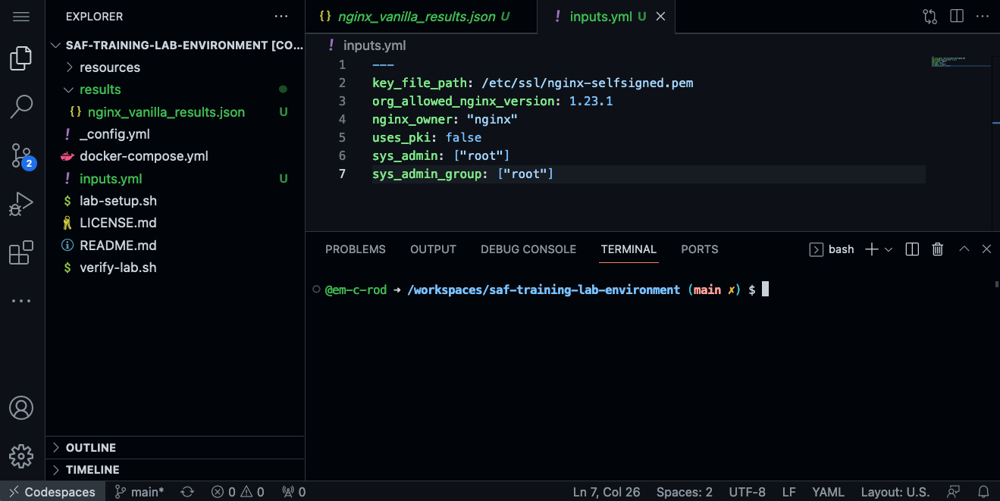
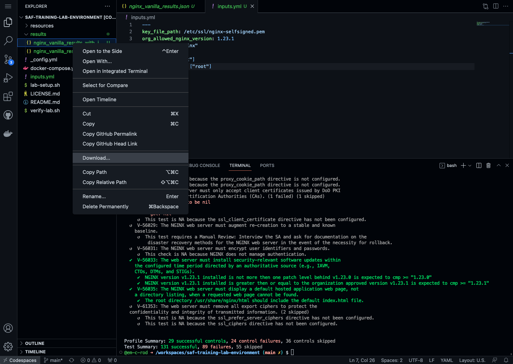
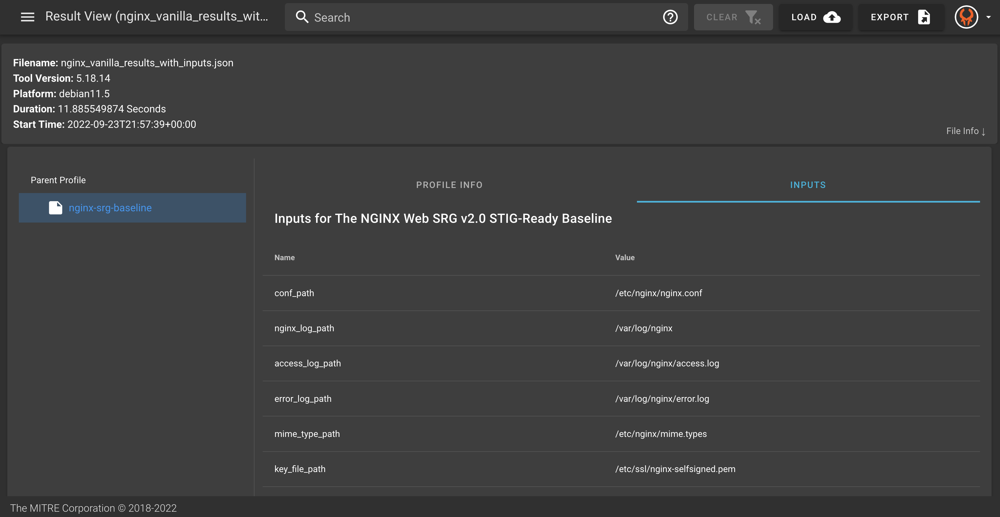

## 7. What are inputs and why do I need them?

Every InSpec profile on the SAF site is written to comply with some security guidance. However, every team's environment may be just a little bit different. For example, the path to a file may be different in different environments, or the list of permitted users for a certain system may vary with the environment. 

To accomodate for these kinds of differences, InSpec profiles utilize inputs. In the previous section, we ran the InSpec profile on the NGINX component without specifying any inputs. This means that it just used the defaults. Now, let's review these variables and decide which inputs we want to change for our environment.

::: tip Best Practice
It is best practice to always run profiles with inputs so that the profile is properly tailored to your environment!
:::

## 7.1 Profile Inputs (see `inspec.yml` file)

This profile uses InSpec Inputs to make the tests more flexible. You are able to provide inputs at runtime either via the cli or via YAML files to help the profile work best in your deployment.

#### **_Do not change the inputs in the `inspec.yml` file_**

The `inputs` configured in the `inspec.yml` file are **profile definition and defaults for the profile** and not for the user. InSpec provides two ways to adjust the profile's inputs at run-time that do not require modifiying `inspec.yml` itself. This is because automated profiles like this one are frequently run from a script, inside a pipeline or some kind of task scheduler. Such automation usually works by running the profile directly from its source (i.e. this repository), which means the runner will not have access to the `inspec.yml`.

To tailor the tested values for your deployment or organizationally defined values, **_you may update the inputs_**.

More information about InSpec inputs can be found in the [InSpec Inputs Documentation](https://docs.chef.io/inspec/inputs/).

## 7.2 Using an --input-file to tailor specifics

For the NGINX example, we are going to add the following inputs. Make a new file called `inputs.yml` in your lab environment:
1. Right click near the file list on the left side
2. Click "New File..."
3. Copy the code below into your `inputs.yml` file.

```yml
---
key_file_path: /etc/ssl/nginx-selfsigned.pem
org_allowed_nginx_version: 1.23.1
nginx_owner: "nginx"
uses_pki: false
sys_admin: ["root"]
sys_admin_group: ["root"]
```

In your codespaces, it should look like this:



::: tip How do I find the values that should be in the input file?
Start by checking the README on the GitHub repository for that InSpec profile. Most of the profiles have a "Tailoring to Your Environment" section that leads you through what variables are available as inputs. 

To determine the value itself, you should think about the environment, talk to your assessor, and explore the target to see if you can find the necessary information.
:::

::: info What is the difference between tailoring an InSpec profile with inputs vs. overlays?
**Inputs** are meant to tailor the profile while _still complying_ to the guidance document for which the profile is based. 

**Overlays** are used in the case that the organization requirements _differ_ from the security guidance. For example, if there are additional controls required or some controls not available for the organization's requirements.
:::

<!-- ## 7.3 Rerun InSpec using the inputs file

We are going to make 2 changes to our InSpec command that we ran before. 
1. We are going to add `--input-file inputs.yml` to specify the inputs to the profile
2. We are going to change the name of our results file to `./results/nginx_vanilla_results_with_inputs.json` so it easy for us to distinguish the results later on.

This makes our new command:

```sh
inspec exec https://github.com/mitre/nginx-stigready-baseline -t docker://nginx --input-file inputs.yml --reporter cli json:./results/nginx_vanilla_results_with_inputs.json
```

### 7.3.1 CLI Results

You will see this result in the cli:

```sh
inspec exec https://github.com/mitre/nginx-stigready-baseline -t docker://nginx --input-file inputs.yml --reporter cli json:./results/nginx_vanilla_results_with_inputs.json
[2022-09-23T21:57:23+00:00] WARN: URL target https://github.com/mitre/nginx-stigready-baseline transformed to https://github.com/mitre/nginx-stigready-baseline/archive/master.tar.gz. Consider using the git fetcher
...
  ✔  V-56033: The web server must install security-relevant software updates within
    the configured time period directed by an authoritative source (e.g., IAVM,
    CTOs, DTMs, and STIGs).
     ✔  NGINX version v1.23.1 installed is not more then one patch level behind v1.23.0 is expected to cmp >= "1.23.0"
     ✔  NGINX version v1.23.1 installed is greater then or equal to the organization approved version v1.23.1 is expected to cmp >= "1.23.1"
  ✔  V-56035: The NGINX web server must display a default hosted application web page, not
    a directory listing, when a requested web page cannot be found.
     ✔  The root directory /usr/share/nginx/html should include the default index.html file.
  ↺  V-61353: The web server must remove all export ciphers to protect the
  confidentiality and integrity of transmitted information. (2 skipped)
     ↺  This test is NA because the ssl_prefer_server_ciphers directive has not been configured.
     ↺  This test is NA because the ssl_ciphers directive has not been configured.


Profile Summary: 29 successful controls, 24 control failures, 36 controls skipped
Test Summary: 131 successful, 89 failures, 55 skipped
```

### 7.3.2 The Results Visualized

Download the new results file.



Upload your new results to [Heimdall](https://heimdall-lite.mitre.org/). When you look at the results in Heimdall, you can verify the inputs that were changed by expanding the File Info and looking at the inputs.

 -->
