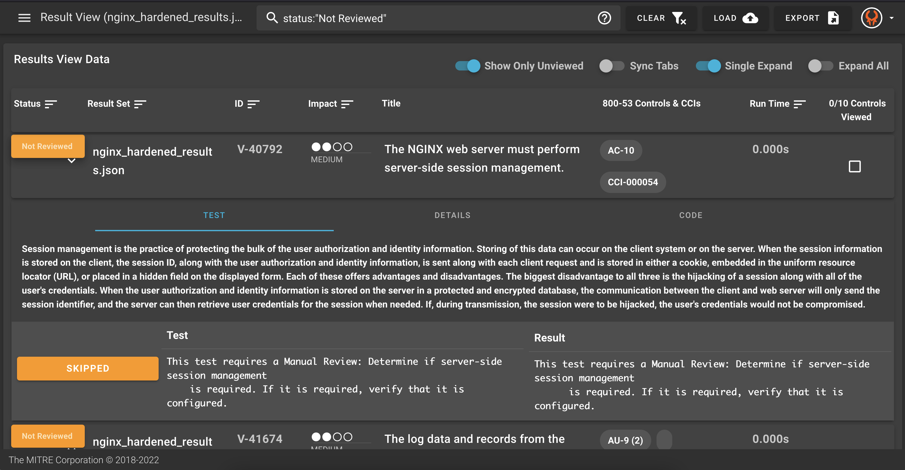

## 12. Manual Attestations

What about controls that cannot be automated and require manual review? You may have noticed that Heimdall displays controls in 4 statuses: `Passed`, `Failed`, `Not Applicable`, and `Not Reviewed`.

Controls may be `Not Reviewed` for multiple reasons. One major reason is that the control requires manual review. You can explore the details of the `Not Reviewed` controls to find out more.

### 12.1 Explore the Not Reviewed Controls

Look at the hardened results again in Heimdall. Go back to the menu in the top left to toggle off "Comparison View" and select on the hardened results.


Scroll down to see the details and learn why the controls were not reviewed.



You can see that for various reasons, many of these controls require manual review. If someone does that manual review, how can we show that in the data?

### 12.2 Manual Attestations Using SAF CLI

You have already seen the InSpec profiles and the Heimdall application that the SAF provides. Another feature of the SAF is the SAF CLI. This is a command line utility tool that helps with various steps in the security automation process. You can see all of the SAF CLI's capability [here](saf-cli.mitre.org), but we will look more at how we can use it to add manual attestation data to our overall results.

### 12.3 Get Familiar with SAF CLI

SAF CLI has been downloaded into your Codespaces lab environmnet, so it is available for you to use on the command line. Try out a few commands to see what you can do!

```sh
saf --version
```

```sh
saf help
```

The help command will give you the information on how to use the SAF CLI:

```sh
The MITRE Security Automation Framework (SAF) Command Line Interface (CLI) brings together applications, techniques, libraries, and tools developed by MITRE and the security community to streamline security automation for systems and DevOps pipelines

VERSION
  @mitre/saf/1.1.12 linux-x64 node-v16.14.2

USAGE
  $ saf [COMMAND]

TOPICS
  attest
  convert   [Normalize]    Convert security results from all your security tools between common data formats
  generate  [Generate]     Generate pipeline thresholds, configuration files, and more
  harden    [Harden]       Implement security baselines using Ansible, Chef, and Terraform content: Visit https://saf.mitre.org/#/harden to explore
            and run hardening scripts
  plugins   List installed plugins.
  scan      [Scan]         Scan to get detailed security testing results: Visit https://saf.mitre.org/#/validate to explore and run inspec profiles
  validate  [Validate]     Verify pipeline thresholds
  view      [Visualize]    Identify overall security status and deep-dive to solve specific security defects

COMMANDS
  convert           The generic convert command translates any supported file-based security results set into the Heimdall Data Format
  convert ckl2poam  Translate DISA Checklist CKL file(s) to POA&M files
  harden            Visit https://saf.mitre.org/#/harden to explore and run hardening scripts
  heimdall          Run an instance of Heimdall Lite to visualize your Data
  help              Display help for saf.
  plugins           List installed plugins.
  scan              Visit https://saf.mitre.org/#/validate to explore and run inspec profiles
  summary           Get a quick compliance overview of an HDF file
  version
```

```sh
saf attest -h
```

This will give you the following information:

```sh
USAGE
  $ saf attest COMMAND

COMMANDS
  attest apply
  attest create
```

### 12.4 Create Manual Attestation Data

After someone on your team completes the manual check that is required for your security control, record that information with the help of the SAF CLI.

First, look at the flags for the `saf attest create` command.

```sh
saf attest create -h
USAGE
  $ saf attest create -o <value> [-h] [-i <value>] [-t json|xlsx|yml|yaml]

FLAGS
  -h, --help             Show CLI help.
  -i, --input=<value>    (optional) An input HDF file to search for controls
  -o, --output=<value>   (required) The output filename
  -t, --format=<option>  [default: json] (optional) The output file type
                         <options: json|xlsx|yml|yaml>
```

So, the output flag is the required flag and the others are optional. Let's define the output file as `./results/manual_attestation_results.json` for the attestation we are going to create.

```sh
saf attest create -o ./results/manual_attestation_results.json
```

Here is an example of an attested control that we can create based on 
1. The results we saw in Heimdall
2. Our (hypothetical) completed manual check (Let's pretend that we did check this!)

```sh
saf attest create -o ./results/manual_attestation_results.json
Enter a control ID or enter 'q' to exit: V-40792
Attestation explanation: Verified that the server-side session management is configured correctly.
Frequency (1d/3d/1wk/2wk/1m/3m/6m/1y/1.5y/custom): 3m
Enter status ((p)assed/(f)ailed): p
Updated By: Emily Rodriguez
Enter a control ID or enter 'q' to exit: 
```

Now, go through the rest of the Not Reviewed results to create those attestations! Type `q` when you are done.

### 12.5 Apply the Manual Attestation Data