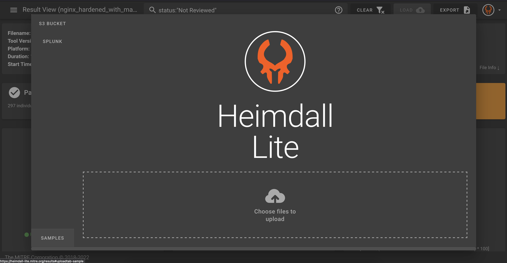
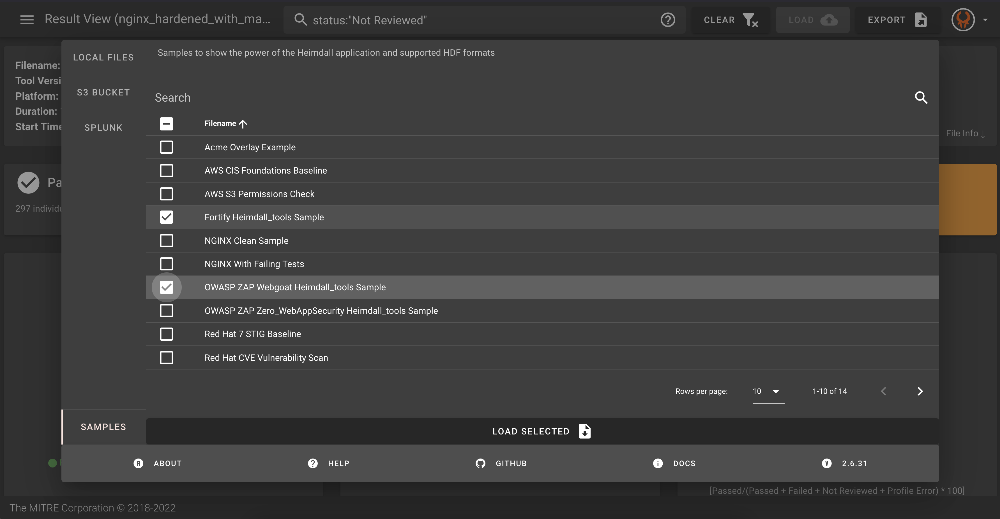
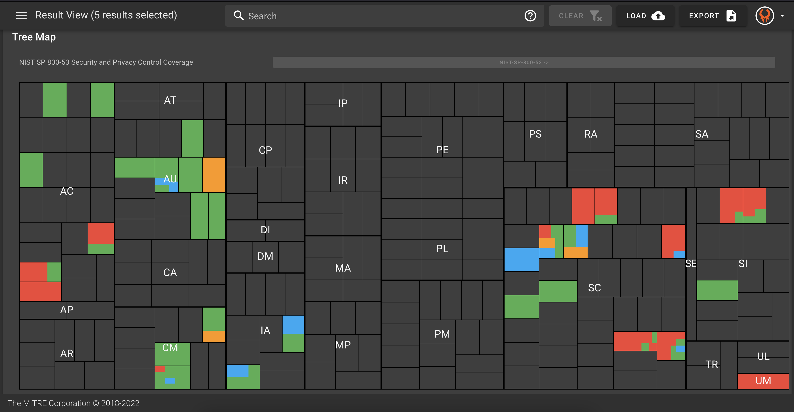
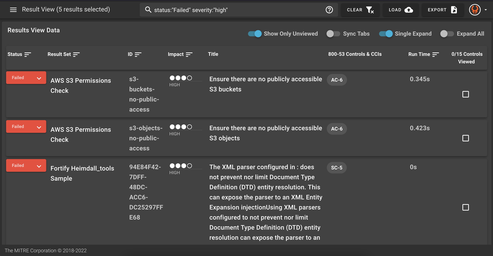

## 14. Normalize

Remember the "Normalize" pillar? We skipped over it when we were doing InSpec validation because InSpec results are automatically in HDF (or Heimdall Data Format). 

However, other tools provide useful security data that is not inherently in HDF. So, to make a full picture of security, we have converters to convert third party data to HDF and HDF back into other forms.

### 14.1 Convert with SAF CLI

The SAF CLI has utilies to convert files from one output to another. Take a look at the ever-growing list of compatible file types at the [SAF CLI README](https://saf-cli.mitre.org/).

### 14.2 Convert with Heimdall

However, you Heimdall can also auto-convert uploaded files in compatible formats, giving you another way to convert data and look at the whole picture at one time. 

Test this out by adding sample files of other data in Heimdall.

Choose some sample data to add to the full security of a theoretical software stack.

### 14.3 Visualize the Big Picture

As you add all of this data into one view, you can see how the NIST 800-53 controls are more filled out as more items are covered by different types of security scans. 

In this big picture view, you can see the whole security posture and filter down, for example, on high failures across all scans. _Your results may look different than these pictures depending on what you have loaded in Heimdall_

And in the results details, you can see what file - in other words what scan or part of the system, is causing the problem.

