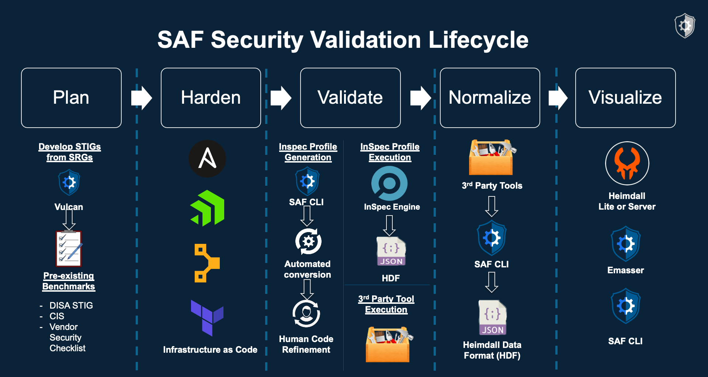

## 1.1 Course Overview
The purpose of this course is to gain understanding and hands-on practical use of MITRE's Security Automation Framework with a focus on automating security validation and visualization. By the end, you should be able to achieve all of the following objectives.

### 1.1.1 Course Objectives:
-	Identify and locate security guidance for a software component
-	Understand the capabilities available in the main pillars of the MITRE Security Automation Framework - Plan, Harden, Validate, Normalize, Visualize
-	Define and run an InSpec profile to validate a component against security guidance.
-	Visualize InSpec results and third party security tool data
- Automatically export checklist results from a security assessment.

## 1.2 The Road to Security Automation

As you can see from the picture below, the process for developing automated security tests starts with requirements documents like SRGs, STIGs or CIS Benchmark that are written in regular, human language and then implemented as code. We need that code to record test results in a standardized format so that we can easily export our security data somewhere people can use it to make decisions (like the Heimdall visualization app).

This challenge is what the [MITRE Security Automation Framework](https://saf.mitre.org) or MITRE SAF was developed to simplify -- to make the journey from a Requirement Document to an automated test profile and back again a little easier to navigate.

