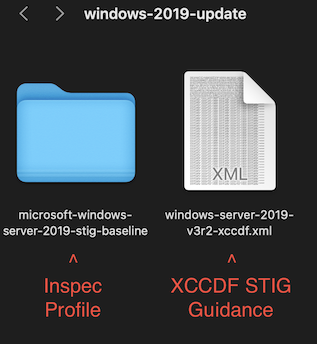

## 4.1 Use Cases for Running Delta

There are several situations that warrant the use of the delta process. These are broken down into the following use cases:

1. [Use Case 1](#411-use-case-1) - Check and update control IDs and metadata based on new guidance (run update controls)

3. [Use Case 2](#415-use-case-2) - Generate stubs for new controls found in the XCCDF Benchmark file (run Delta without fuzzy matching)

4. [Use Case 3](#414-use-case-3) - No mappings were found using update controls (run Delta with fuzzy matching)


### 4.1.1 Use Case 1

Updated guidance sometimes modifies the control identification (ID) values of a given control. To make these modifications from baseline X to baseline Y, use the update controls process with the provided XCCDF guidance. The process checks if the new guidance changes the control numbers and updates them if necessary.

Suppose we want to update our [Windows Server 2019 inspec profile repository](https://github.com/mitre/microsoft-windows-server-2019-stig-baseline/t) to the latest version. We would take the following steps:

#### Step 1: Collect necessary files:
1. Download or clone the Windows Server 2019 profile repository to your system.
2. Download the [latest STIG](https://public.cyber.mil/stigs/downloads/) place the XCCDF XML file into your working directory.


#### Step 2: Generate a profile summary
Use the `inspec json` command to generate a profile summary of the inspec profile


#### Step 3: Run Update Controls
Use the `update_controls4delta` method using the profile summary file, the STIG guidance file, and the controls directory for the inspec profile as inputs.
```
saf generate update_controls4delta -X ./windows-server-2019-v3r2-xccdf.xml -J ./profile.json -c ./microsoft-windows-server-2019-stig-baseline/controls
```


The output should look like this:


**Process:** Run `update_controls4delta`

[return to top](#41-use-cases-for-running-delta)

### 4.1.4 Use Case 2

New guidance often contains new controls that weren't previously defined. In this case, running the delta process generates the control stubs with all metadata, except for the describe block (code) content.

**Process:** Run `delta`

[return to top](#41-use-cases-for-running-delta)

### 4.1.5 Use Case 3

Running update controls may result in no controls being updated or no mappings being found from baseline X to baseline Y. This could be due to the baselines belonging to different platforms, or too many revisions were released between the two baselines, creating no way to map between them. In this case, use Delta with fuzzy matching.

**Process:** Run `delta`

[return to top](#41-use-cases-for-running-delta)
